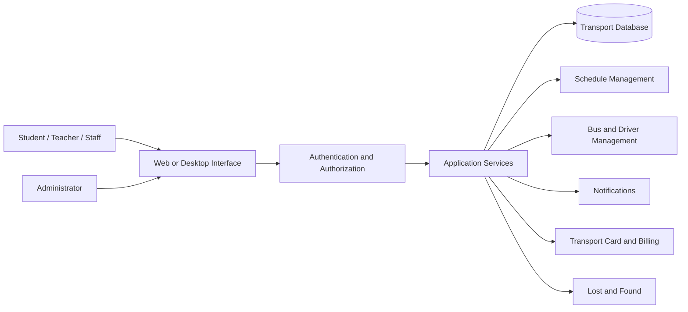
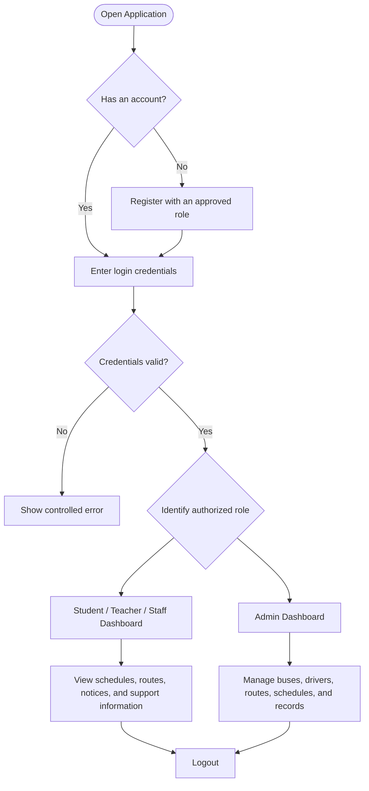

# DIU Transport Schedule System

> A role-based transport scheduling and management system designed as a university project initiative for Daffodil International University (DIU).

[](#project-status)
[](#technology-stack)
[](#technology-stack)
[](#technology-stack)
[](#license)

---

## Table of Contents

- [Overview](#overview)
- [Project Status](#project-status)
- [Objectives](#objectives)
- [User Roles](#user-roles)
- [Core Features](#core-features)
- [Technology Stack](#technology-stack)
- [System Architecture](#system-architecture)
- [Original Java Desktop Structure](#original-java-desktop-structure)
- [Application Workflow](#application-workflow)
- [Security Requirements](#security-requirements)
- [Development Roadmap](#development-roadmap)
- [Setup Status](#setup-status)
- [Documentation](#documentation)
- [Repository Guidelines](#repository-guidelines)
- [Future Improvements](#future-improvements)
- [Disclaimer](#disclaimer)
- [License](#license)

---

## Overview

The **DIU Transport Schedule System** is intended to organize and manage university transport information through a structured, role-based application.

The system is designed to support transport schedules, routes, buses, drivers, employees, notifications, transport-card information, billing status, emergency contacts, feedback, and lost-and-found records.

The long-term goal is to create a practical system that can reduce manual work, improve schedule visibility, and provide controlled access to transport information for students, teachers, staff members, and administrators.

---

## Project Status

> **Current state: Active recovery and development**

A Phase 1 technical audit found that the repository contains two incomplete implementations:

- A legacy **Java 17 Swing desktop application**
- A separate **Node.js, Express, and SQLite web implementation**
- A placeholder web frontend
- No verified end-to-end working feature at the time of the audit
- No automated test suite at the time of the audit

The project is being reorganized through controlled development phases.

### Current architectural direction

- The web implementation is being prepared as the future canonical application.
- The Java Swing implementation is retained as a legacy or reference version.
- The Java and web applications must not use the same runtime database.
- Security, reproducible setup, authentication, and schedule management are the immediate priorities.

---

## Objectives

The system is intended to:

- Provide clear and updated university bus schedules
- Manage buses, routes, drivers, employees, and assigned trips
- Support Student, Teacher, Staff, and Admin roles
- Restrict administrative operations through role-based access control
- Display route stops, departure time, arrival time, and assigned buses
- Support special transport arrangements for examinations and events
- Track transport-card validity and payment status
- Publish schedule updates, cancellations, and transport notices
- Provide emergency contact and feedback facilities
- Maintain a practical lost-and-found workflow
- Remain modular, maintainable, testable, and expandable

---

## User Roles

| Role | Main Access |
|---|---|
| **Student** | View schedules, routes, alerts, transport-card status, billing status, contacts, and submitted reports |
| **Teacher** | View schedules, routes, alerts, special-trip information, contacts, and profile information |
| **Staff** | View transport information and access staff-authorized services |
| **Admin** | Manage users, buses, routes, drivers, employees, schedules, notices, cards, billing records, contacts, and lost-and-found entries |

> Administrative permissions must be enforced by the backend. Hiding buttons in the user interface is not sufficient security.

---

## Core Features

### 1. User and Administrator Management

- Role-based registration and login
- User profile view and update
- Controlled account status
- Secure administrator provisioning
- Admin-only system-management operations
- Session or token-based authentication
- Server-side authorization

### 2. Bus Information and Scheduling

- Daily transport schedule
- Bus number and current status
- Pickup points and route stops
- Departure and arrival time
- Route and bus assignment
- Administrator schedule creation, update, and cancellation
- Bus and driver conflict prevention
- Special schedules for examinations and events

### 3. Driver and Employee Management

- Driver name and contact details
- Assigned bus
- Shift information
- Transport officer records
- Helper and maintenance employee records
- Active and inactive employee status

### 4. Digital Transport Card

- Card ID
- Validity period
- Payment status
- Card status:
  - `ACTIVE`
  - `EXPIRED`
  - `PENDING`

### 5. Billing and Transport Cost Information

- Transport cost chart
- Payment-status tracking
- Supported statuses:
  - `PAID`
  - `DUE`
  - `PARTIAL`

> No online payment gateway is currently required. The module is intended for status tracking only.

### 6. Contact and Support

- Transport manager contact
- Transport officer contact
- Emergency hotline
- Feedback and contact form

### 7. Notifications and Alerts

- Schedule updates
- Bus cancellation notices
- New route announcements
- Special-trip information
- Local or database-driven alerts

### 8. Lost and Found

- Report lost items
- Report found items
- Associate reports with a bus, route, date, and approximate time
- Administrator review and remarks
- Claim-verification workflow
- Return and closure status

Suggested lifecycle:

```text
REPORTED
   ↓
UNDER_REVIEW
   ↓
POSSIBLE_MATCH
   ↓
CLAIM_PENDING
   ↓
VERIFIED
   ↓
RETURNED
   ↓
CLOSED
```

---

## Technology Stack

### Legacy desktop implementation

| Area | Technology |
|---|---|
| Language | Java 17 |
| User interface | Java Swing |
| Database | SQLite |
| Database access | JDBC |
| Architecture | OOP-based desktop application |

### Web implementation under development

| Area | Technology |
|---|---|
| Backend | Node.js and Express |
| Frontend | Existing HTML, CSS, and JavaScript structure |
| Database | Isolated SQLite development database |
| Authentication | Secure server-side authentication |
| Testing | Automated Node.js tests planned or being added |

### Future production direction

A real multi-user university deployment may later require:

- PostgreSQL
- Production-grade hosting
- Managed backups
- Monitoring and logging
- University-approved identity verification
- Official data-protection and access policies

---

## System Architecture



### Main design principles

- **Encapsulation:** Internal data should be protected through controlled methods.
- **Abstraction:** Interfaces and services should hide low-level implementation details.
- **Inheritance:** Shared user behavior can be inherited by Student, Teacher, Staff, and Admin models where appropriate.
- **Polymorphism:** Role-specific behavior can be implemented through common interfaces or parent types.
- **Modularity:** Models, services, database logic, validation, and user-interface code should remain separate.
- **Least privilege:** Every role should receive only the permissions it actually needs.

---

## Original Java Desktop Structure

The following structure represents the original Java desktop design supplied for the project.

<details>
<summary><strong>Click to view the complete Java project tree</strong></summary>

```text
diu-transport-system/
├── src/
│   ├── model/
│   │   ├── enums/
│   │   │   ├── UserRole.java
│   │   │   ├── PaymentStatus.java
│   │   │   ├── CardStatus.java
│   │   │   ├── NotificationType.java
│   │   │   ├── LostFoundStatus.java
│   │   │   ├── EmployeeRole.java
│   │   │   ├── DriverShift.java
│   │   │   ├── BusStatus.java
│   │   │   └── ContactRole.java
│   │   ├── User.java
│   │   ├── Student.java
│   │   ├── Teacher.java
│   │   ├── Staff.java
│   │   ├── Admin.java
│   │   ├── Bus.java
│   │   ├── Driver.java
│   │   ├── Employee.java
│   │   ├── Schedule.java
│   │   ├── Route.java
│   │   ├── TransportCard.java
│   │   ├── Billing.java
│   │   ├── Notification.java
│   │   ├── LostFound.java
│   │   └── Contact.java
│   ├── services/
│   │   ├── UserService.java
│   │   ├── BusService.java
│   │   ├── DriverService.java
│   │   ├── ScheduleService.java
│   │   ├── TransportCardService.java
│   │   ├── BillingService.java
│   │   ├── NotificationService.java
│   │   └── LostFoundService.java
│   ├── gui/
│   │   ├── DIUTransportSystem.java
│   │   ├── LoginFrame.java
│   │   ├── RegisterFrame.java
│   │   ├── UserDashboard.java
│   │   └── AdminDashboard.java
│   ├── util/
│   │   ├── Constants.java
│   │   ├── DatabaseConnection.java
│   │   ├── SessionManager.java
│   │   └── ValidationUtil.java
│   └── storage/
│       └── FileManager.java
├── lib/
│   └── sqlite-jdbc-3.44.1.0.jar
├── diu_transport.db
├── README.md
└── run.bat
```

</details>

### Folder responsibilities

| Folder | Responsibility |
|---|---|
| `model/` | Domain objects and main application entities |
| `model/enums/` | Controlled values for roles, status, shifts, and categories |
| `services/` | Business rules and operations |
| `gui/` | Swing frames, dashboards, and interface components |
| `util/` | Configuration, validation, sessions, and database helpers |
| `storage/` | File-based persistence utilities |
| `lib/` | Legacy manually managed dependencies |
| `docs/` | Audit reports, architecture decisions, and development evidence |

> The manually stored JDBC JAR and local database approach require review before the desktop version can be considered reproducible.

---

## Application Workflow



---

## Security Requirements

The final system should follow these minimum rules:

- Public registration must never create an `ADMIN`
- Passwords must never be stored in plaintext
- A known default administrator must not be created automatically
- Failed authentication must not grant a demo or fallback session
- Administrator creation must use an explicit secure provisioning process
- Protected backend routes must validate authentication
- Role permissions must be checked on the server
- SQL queries must use parameters
- Secrets must be stored outside source code
- Runtime database files containing private data must not be committed
- Personal data must be fictional or formally approved for development
- Error responses must not expose stack traces, SQL, or secrets

---

## Development Roadmap

### Phase 1 — Repository Audit

- Repository inventory
- Build and runtime analysis
- Security review
- Feature implementation matrix
- Database review
- Cleanup-candidate classification
- Architecture recommendation

### Phase 2 — Secure Web Baseline

- Select the web application as the canonical implementation
- Preserve the Java application as legacy/reference
- Install reproducible dependencies
- Isolate the web database
- Secure registration and login
- Add explicit administrator provisioning
- Enforce role authorization
- Implement a schedule-management vertical slice
- Add automated tests

### Phase 3 — Planned Expansion

Possible priorities:

- Bus and route management completion
- Driver and employee administration
- Special trips
- Notification management
- Transport cards and billing status
- Lost-and-found claim verification
- Audit logging
- Frontend redesign
- PostgreSQL migration planning
- Deployment preparation

---

## Setup Status

> The setup process is being standardized. Do not assume that the legacy desktop or web application is currently production-ready.

Before running the project:

1. Read the latest reports inside `docs/`.
2. Check the active implementation described in the current phase documentation.
3. Install only the dependencies listed in the relevant package or build files.
4. Create local environment variables from `.env.example`.
5. Do not use real credentials or production data.
6. Use an isolated development database.
7. Run the documented tests before demonstrating the application.

### Important files

```text
README.md
.env.example
.gitignore
package.json
backend/
frontend/
docs/phase-1/
docs/phase-2/
```

Exact installation and execution commands should be taken from the latest verified phase documentation.

---

## Documentation

Technical documentation is maintained inside the `docs/` folder.

Examples include:

```text
docs/
├── phase-1/
│   ├── PHASE_1_AUDIT_REPORT.md
│   ├── REPOSITORY_INVENTORY.md
│   ├── BUILD_AND_RUNTIME_REPORT.md
│   ├── FEATURE_IMPLEMENTATION_MATRIX.md
│   ├── ARCHITECTURE_AND_CODE_QUALITY_REPORT.md
│   ├── DATABASE_AUDIT.md
│   ├── SECURITY_AND_PRIVACY_AUDIT.md
│   ├── UI_AND_ASSET_AUDIT.md
│   ├── CLEANUP_CANDIDATES.md
│   └── PHASE_2_RECOMMENDATION.md
└── phase-2/
    └── Phase 2 implementation and verification documents
```

---

## Repository Guidelines

### Do not commit

```text
.env
node_modules/
target/
build/
dist/
out/
coverage/
*.log
*.db
*.sqlite
*.sqlite3
```

A database file may be committed only when it contains safe demonstration data and the decision is explicitly documented.

### Recommended branch naming

```text
audit/phase-1-repository-review
feature/phase-2-web-baseline
feature/schedule-management
fix/authentication-security
docs/update-readme
```

### Recommended commit style

```text
chore: establish project baseline
fix(auth): prevent public administrator registration
feat(schedule): add schedule conflict validation
test: add authentication integration tests
docs: improve setup and architecture documentation
```

---

## Future Improvements

- PostgreSQL migration for multi-user deployment
- Live bus tracking
- Interactive campus and route maps
- Email or SMS notices
- QR-based transport cards
- Advanced reporting and analytics
- Maintenance scheduling
- Driver attendance
- University identity-system integration
- Backup and recovery automation
- Accessibility improvements
- Responsive mobile experience
- Audit logs for sensitive administrative operations

---

## Disclaimer

This repository is an academic and development initiative. It is not presented as an official production service of Daffodil International University unless formally approved by the university.

Do not store or publish real student, employee, driver, payment, or identity information without proper authorization and data-protection controls.

---

## License

No software license has been selected yet.

Before public reuse or external contribution, add an appropriate license such as MIT, Apache-2.0, or another license approved by the project owner.

---

<p align="center">
  <strong>DIU Transport Schedule System</strong><br>
  Built as a structured university transport-management initiative.
</p>
