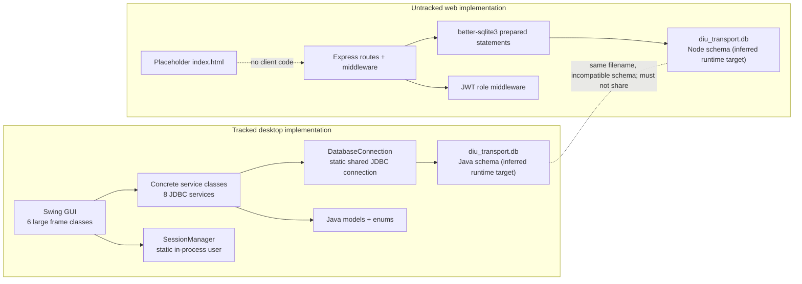

# Architecture and Code Quality Report

## Actual architecture

The repository is not one integrated full-stack application. It contains two implementations with no code-level bridge.

Dashed relationships are inference from configured runtime paths; neither database exists and neither implementation reached DB startup.

## Desktop assessment

- Type: Swing desktop application, not JavaFX and not a backend server.
- Layers exist by folder name, but boundaries are weak: GUI classes contain hardcoded data and behavior; services issue SQL directly; no DAO/repository interfaces exist.
- OOP is partly genuine: `Student`, `Teacher`, `Staff`, and `Admin` inherit `User`; fields are mostly private; enums exist.
- OOP consistency is weak: several models store status/shift/role concepts as strings despite parallel enums; classes are mutable; services depend on concrete global DB state.
- Role access is not enforced inside service/business methods. `SessionManager` is a single static in-memory user, suitable only for a local single-user process.
- No circular package dependency was confirmed, but GUI-to-service-to-global-DB coupling is strong.
- `AdminDashboard` (1,138 lines), `UserDashboard` (963), `RegisterFrame` (913), and `LoginFrame` (661) are god-class candidates.
- Swing entry is generally dispatched on the EDT, but authentication/DB work is also launched through a `SwingWorker`; this area needs manual responsiveness testing once runnable.

## Web assessment

- Type: Express REST server plus a placeholder static page.
- Middleware provides token authentication and route-level role checks for many admin endpoints.
- SQL uses `better-sqlite3` prepared statements in reviewed CRUD routes, reducing conventional value-based SQL injection risk.
- There is no controller/service/repository separation: validation, policy, SQL, response mapping, and errors live in route files.
- Authentication payload embeds role; middleware trusts the token and does not re-query current account status/role.
- The server is not a Java backend and does not use or call the Java application.

## Desktop-versus-web evidence

| Question | Evidence-based answer |
|---|---|
| Current primary tracked app | Desktop Swing |
| Real backend server | Only in pre-existing untracked Node files; not runnable |
| Browser frontend | Placeholder only |
| `frontend`/`backend` separate apps | Naming reflects a proposed web app; frontend is incomplete |
| Python | Not used |
| ORM | None in either implementation |
| SQLite direct access | JDBC in Java; `better-sqlite3` in Node |
| Recoverable without full rewrite | Yes, after choosing one implementation; combining them as-is is unsafe |

## Code-quality findings

| Finding | Severity | Confidence | Evidence |
|---|---|---|---|
| Plaintext password domain field and SQL | CRITICAL | CONFIRMED | `User`, `UserService`, Java `users.password` |
| Failed-login demo bypass | HIGH | CONFIRMED | `LoginFrame.java:466-471` |
| Global mutable connection/session | HIGH/MEDIUM | CONFIRMED | `DatabaseConnection.connection`; `SessionManager.currentUser` |
| UI, mock data, behavior mixed | MEDIUM | CONFIRMED | four large GUI files; hardcoded Swing tables |
| Repeated JDBC CRUD/mapping/error patterns | MEDIUM | CONFIRMED | all eight services |
| SQL string construction | MEDIUM/HIGH | CONFIRMED | schedule day query; backup/restore paths; table-count loop |
| Exception swallowing/defaulting | MEDIUM | CONFIRMED | model date parsing returns false/zero; services print and return false/empty |
| Resource leak candidate | MEDIUM | STRONGLY INDICATED | `DatabaseConnection.executeQuery` returns a `ResultSet` while its `Statement` is not exposed/closed |
| Date/time parsing risks | MEDIUM | CONFIRMED | strings in schema/models; mixed `HH:mm` and `h:mm AM` data |
| Inconsistent enum use | MEDIUM | CONFIRMED | `Bus.status`, `Driver.shift`, `Notification.type` strings alongside enums |
| Missing `equals`/`hashCode` | LOW | CONFIRMED | mutable model entities define neither |
| Commented TODO/FIXME/empty catch | INFORMATIONAL | CONFIRMED | No meaningful TODO/FIXME or empty catch block found; comments often claim completeness not proven by tests |

## Maintainability conclusion

The desktop architecture can be repaired incrementally for a local demo, but authentication and persistence must be treated as foundational defects. For a multi-user system, the web API offers a more relevant direction, yet it should be normalized into clear service/repository boundaries and paired with a real frontend only after security and schema decisions. A wholesale rewrite is not justified by Phase 1 evidence; a controlled selection and stabilization is.
